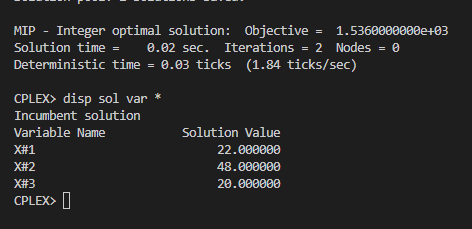

# 1

## Código ZIMPL  file.zpl

    set indice := {1, 2, 3};
 
    param lucroProd[indice] := <1> 30, <2> 12, <3> 15;

    var quantProd[indice] integer;

    maximize lucro: sum<i> in indice :lucroProd[i] * quantProd[i];

    subto tempoFresa: quantProd[1] + quantProd[2] + quantProd[3] <= 500;

    subto tempoTorno: quantProd[1] + quantProd[2] <= 350;

    subto tempoRetifica: quantProd[1] + quantProd[3] <= 150;

    subto vendaProd3: quantProd[3] <= 20;

## CLI ZIMPL

Comandos para compilar arquivo *.zpl:

    zimpl file.zpl
    <!-- output  file.lp -->
    <!-- output  file.tbl -->

## CLI CPLEX

Abrir CLI CPLEX:

    cplex

Comando para ler modelo compilado do ZIMPL no CPLEX:

    r file.lp

Comando para otimizar problema lido:

    opt

Comando exibir solução:

    disp sol var *

