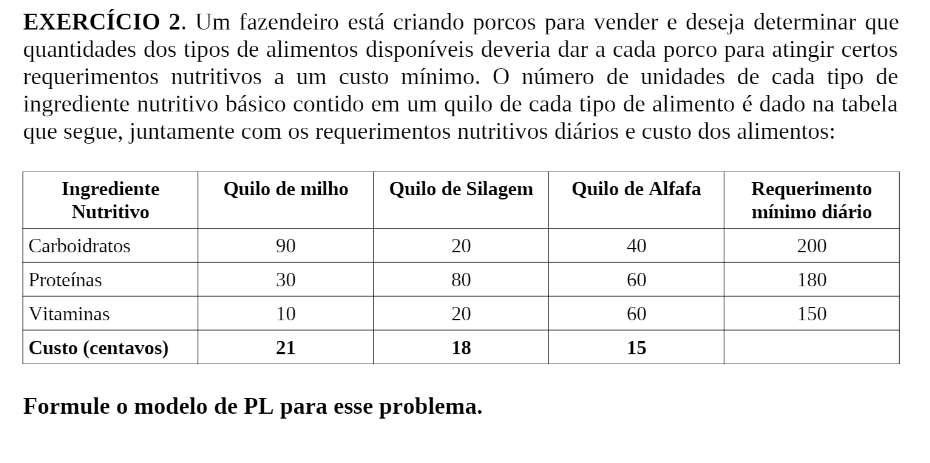
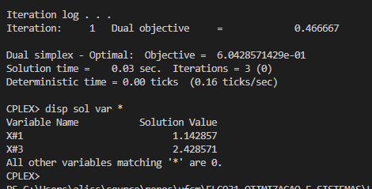

# 2

## Código ZIMPL  file.zpl

    # milho, silagem, alfafa
    set indice := {1, 2, 3};

    param custoAlimentoKgReais[indice] := <1> 0.21, <2> 0.18, <3> 0.15;

    param qtdCarboidratros[indice] := <1> 90, <2> 20, <3> 40;

    param qtdProteinas[indice] := <1>30, <2> 80, <3> 60;

    param qtdVitaminas[indice] := <1>10, <2> 20, <3> 60;

    var quantAlimentoKG[indice] >= 0;

    minimize custo: sum<i> in indice : custoAlimentoKgReais[i] * quantAlimentoKG[i];

    subto carboidratos:  sum<i> in indice : qtdCarboidratros[i] * quantAlimentoKG[i] >= 200;

    subto proteinas: sum<i> in indice : qtdProteinas[i] * quantAlimentoKG[i] >= 180;

    subto vitaminas: sum<i> in indice : qtdVitaminas[i] * quantAlimentoKG[i] >= 150;

## CLI ZIMPL

Comandos para compilar arquivo *.zpl:

    zimpl file.zpl
    <!-- output  file.lp -->
    <!-- output  file.tbl -->

## CLI CPLEX

Abrir CLI CPLEX:

    cplex

Comando para ler modelo compilado do ZIMPL no CPLEX:

    r file.lp

Comando para otimizar problema lido:

    opt

Comando exibir solução:

    disp sol var *

