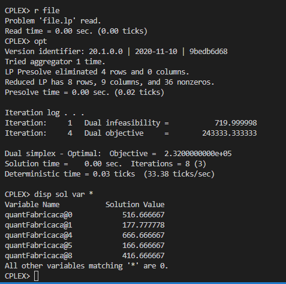

# 3

## Código ZIMPL  file.zpl

    # filiais
    set f := {1 to 3};

    # produto
    # grande, medio e pequeno
    set p := {1, 2, 3};

    # fabrica * produto 
    set fp := f * p;

    # lucro unitario de cada produto
    param L[p] := <1> 140, <2> 120, <3> 100;

    # capacidade de producao de cada fabrica
    param C[f] := <1> 750, <2> 900, <3> 450;

    # espaco disponível para armazenamento em cada fabrica
    param E[f] := <1> 1170, <2> 1080, <3> 450;

    # tamanho dos produtos
    param T[p] := <1> 1.8, <2> 1.35, <3> 1.08;

    # previsao de venda
    param V[p] := <1> 900, <2> 1200, <3> 750;

    # Capacidade de produção geral
    param CPG := sum <fx> in f : C[fx]; 

    # Capacidade de produção proporcional
    param CPP[f] := 
        <1> C[1]/CPG,
        <2> C[2]/CPG, 
        <3> C[3]/CPG;

    var X[fp] >= 0;

    maximize lucro:
        sum<fx, px> in fp :
            L[px] * X[fx, px];

    # limite de produção das fabricas
    subto c1: 
        forall <fx> in f :
            sum <px> in p : X[fx, px] <= C[fx];

    # limite de armazenamento das fabricas
    subto c2:
        forall <fx> in f :
            sum <px> in p : X[fx, px] * T[px] <= E[fx];

    # restrição de quantidade de vendas
    subto c3:
        forall <px> in p :
            sum <fx> in f : X[fx, px] <= V[px];

    # distribuição balanceada de carga de trabalho entre todas as frabicas
    subto c4:
        forall <fx> in f :
            CPP[fx] * (sum <ff, px> in fp : X[ff, px])  == sum <px> in p : X[fx, px];
    

## CLI ZIMPL

Comandos para compilar arquivo *.zpl:

    zimpl file.zpl
    <!-- output  file.lp -->
    <!-- output  file.tbl -->

## CLI CPLEX

Abrir CLI CPLEX:

    cplex

Comando para ler modelo compilado do ZIMPL no CPLEX:

    r file.lp

Comando para otimizar problema lido:

    opt

Comando exibir solução:

    disp sol var *

