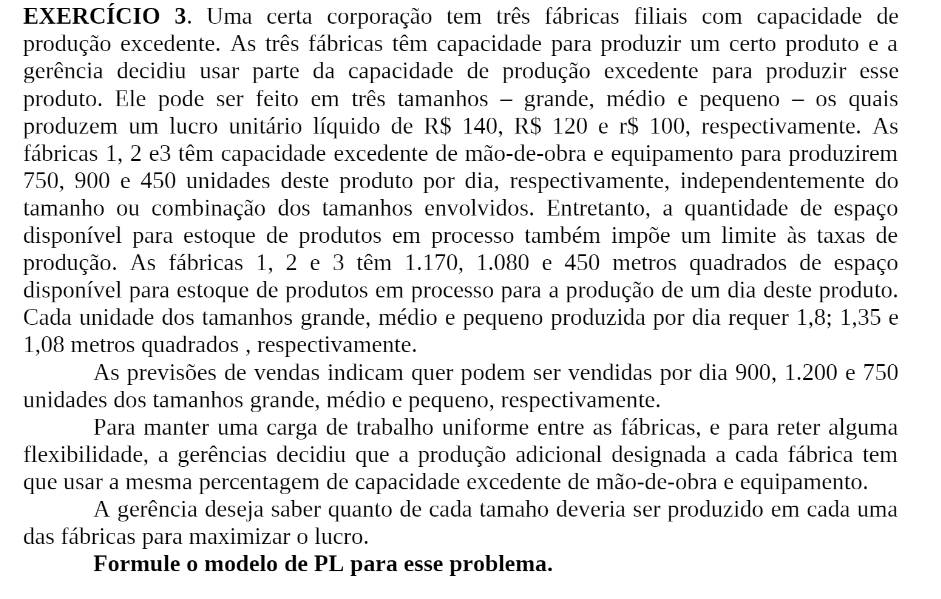

# 3

## Código ZIMPL  file.zpl

    # grande, medio e pequeno
    set tamanho := {1, 2, 3};

    set filial := {1, 2, 3};

    set matrizTamanhoFilial := tamanho * filial;

    param lucroUnitarioEmReais[tamanho] := <1> 140, <2> 120, <3> 100;

    param capacidadeProducao[filial] := <1> 750, <2> 900, <3> 450;

    param espacoArmazenamentoEmMetros2[filial] := <1> 1170, <2> 1080, <3> 450;

    param tamanhoUnitarioPecaEmMetros2[tamanho] := <1> 1.8, <2> 1.35, <3> 1.08;

    param previsaoVenda[tamanho] := <1> 900, <2> 1200, <3> 750;

    param somaCapacidadeProducao := sum <f> in filial : capacidadeProducao[f]; 

    param proporcaoProducaoEmFiliais[filial] := 
        <1> capacidadeProducao[1]/somaCapacidadeProducao,
        <2> capacidadeProducao[2]/somaCapacidadeProducao, 
        <3> capacidadeProducao[3]/somaCapacidadeProducao;

    var quantFabricacao[matrizTamanhoFilial] >= 0;

    maximize lucro: sum<f, t> in matrizTamanhoFilial : lucroUnitarioEmReais[t] * quantFabricacao[f, t];

    subto limiteProducao: 
        forall <f> in filial do
            sum <t> in tamanho : quantFabricacao[f, t] <= capacidadeProducao[f];

    subto limiteArmazenamento:
        forall <f> in filial do
            sum <t> in tamanho : quantFabricacao[f, t] * tamanhoUnitarioPecaEmMetros2[t] <= espacoArmazenamentoEmMetros2[f];

    subto limiteVenda:
        forall <f> in filial do
            sum <t> in tamanho : quantFabricacao[f, t] <= previsaoVenda[f];

    subto producaoEquivalenteEmFiliais:
        forall <f> in filial do
            proporcaoProducaoEmFiliais[f] * (sum <ff, p> in matrizTamanhoFilial : quantFabricacao[ff, p])  == sum
 in tamanho : quantFabricacao[f, p];

## CLI ZIMPL

Comandos para compilar arquivo *.zpl:

    zimpl file.zpl
    <!-- output  file.lp -->
    <!-- output  file.tbl -->

## CLI CPLEX

Abrir CLI CPLEX:

    cplex

Comando para ler modelo compilado do ZIMPL no CPLEX:

    r file.lp

Comando para otimizar problema lido:

    opt

Comando exibir solução:

    disp sol var *

