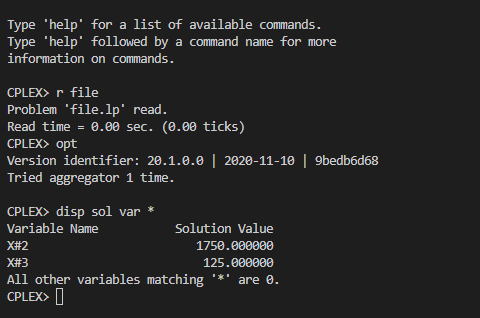

# 4

## Código ZIMPL  file.zpl

    # Chapas: A, B e C
    set c := {1 to 3};

    # Processo: prensado ou esmaltado
    set p := {1, 2};

    # chapas * processo
    set cp := c * p;

    # limite de tempo de uso em cada processo
    param T[p] := <1> 2000, <2> 8000;

    # tempo gasto por chapa em cada processo
    param CP[cp] := 
                    <1,1> 1, <1,2> 3,
                    <2,1> 1, <2,2> 4.5,
                    <3,1> 2, <3,2> 1;

    # lucro por chapa produzida
    param L[c] := <1> 5, <2> 7 , <3> 8;

    # quantidade de chapas produzidas
    var X[c] >= 0;

    maximize lucro : 
        sum <cx> in c :
            L[cx] * X[cx];

    # limite de tempo para producao de chapas
    subto  c1:
        forall <px> in p:
            sum <cx> in c:
                CP[cx, px] * X[cx] <= T[px];

## CLI ZIMPL

Comandos para compilar arquivo *.zpl:

    zimpl file.zpl
    <!-- output  file.lp -->
    <!-- output  file.tbl -->

## CLI CPLEX

Abrir CLI CPLEX:

    cplex

Comando para ler modelo compilado do ZIMPL no CPLEX:

    r file.lp

Comando para otimizar problema lido:

    opt

Comando exibir solução:

    disp sol var *

