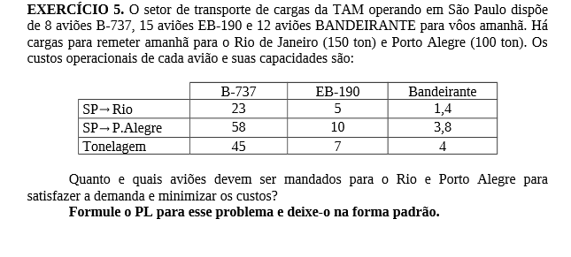
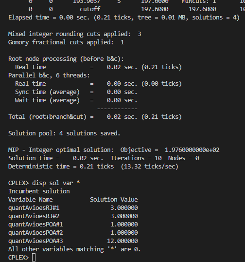

# 5

## Código ZIMPL  file.zpl

    set tipoAviao := {1, 2, 3};

    # RJ, POA
    set destino := {1, 2};

    param custoViagemRJ[tipoAviao] := <1> 23, <2> 5, <3> 1.4;
    param custoViagemPOA[tipoAviao] := <1> 58, <2> 10, <3> 3.8;

    param cargaTransportada[destino] := <1> 150, <2> 100;

    param disponibilidadeAviao[tipoAviao] := <1> 8, <2> 15, <3> 12;

    param tonelagemAvioes[tipoAviao] := <1> 45, <2> 7, <3> 4;

    var quantAvioesRJ[tipoAviao] integer >= 0;
    var quantAvioesPOA[tipoAviao] integer >= 0;

    minimize custo : 
        (sum <t> in tipoAviao : quantAvioesRJ[t] * custoViagemRJ[t]) +
        (sum <t> in tipoAviao : quantAvioesPOA[t] * custoViagemPOA[t]);

    subto cargaTransportadaRJ :
        sum <t> in tipoAviao : quantAvioesRJ[t] * tonelagemAvioes[t] >= cargaTransportada[1];

    subto cargaTransportadaPOA :
        sum <t> in tipoAviao : quantAvioesPOA[t] * tonelagemAvioes[t] >= cargaTransportada[2];

    subto limiteAviao:
        forall <t> in tipoAviao :
            (quantAvioesRJ[t] + quantAvioesPOA[t]) <= disponibilidadeAviao[t];

## CLI ZIMPL

Comandos para compilar arquivo *.zpl:

    zimpl file.zpl
    <!-- output  file.lp -->
    <!-- output  file.tbl -->

## CLI CPLEX

Abrir CLI CPLEX:

    cplex

Comando para ler modelo compilado do ZIMPL no CPLEX:

    r file.lp

Comando para otimizar problema lido:

    opt

Comando exibir solução:

    disp sol var *

