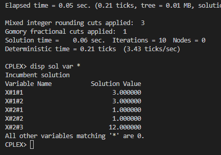

# 5

## Código ZIMPL  file.zpl

    # Incorreto
    
    # B-737, EB-190, Bandeirante
    set tipoAviao := {1, 2, 3};

    # SP-Rio, SP-PoA
    set destino := {1, 2};

    set matrizTipoAviaoDestino := tipoAviao * destino;

    param disponibilidadeAvioes[tipoAviao] := <1> 8, <2> 15, <3> 13;

    param custoViagem[matrizTipoAviaoDestino] := 
        # SP-Rio
        <1, 1> 23, <2, 1> 5, <3, 1> 1.4, 
        # SP-PoA
        <1, 2> 58, <2, 2> 10, <3, 2> 3.8;

    param tonelagem[tipoAviao] := <1> 45, <2> 7, <3> 4;

    param tonelagemMaximaDestino[destino] := <1> 150, <2> 100;

    var quantidadeAvioesPorDestino[matrizTipoAviaoDestino] >= 0;

    minimize custos : sum <t, d> in matrizTipoAviaoDestino : quantidadeAvioesPorDestino[t, d] * custoViagem[t, d];

    subto quantidadeLimiteAvioes :
        forall <t> in tipoAviao do
            sum <d> in destino : quantidadeAvioesPorDestino[t, d] <= disponibilidadeAvioes[t];

        
    subto tonelagemLimiteDestino: 
        forall <d> in destino do
            sum <t> in tipoAviao : quantidadeAvioesPorDestino[t, d] * tonelagem[t] <= tonelagemMaximaDestino[d];  

## CLI ZIMPL

Comandos para compilar arquivo *.zpl:

    zimpl file.zpl
    <!-- output  file.lp -->
    <!-- output  file.tbl -->

## CLI CPLEX

Abrir CLI CPLEX:

    cplex

Comando para ler modelo compilado do ZIMPL no CPLEX:

    r file.lp

Comando para otimizar problema lido:

    opt

Comando exibir solução:

    disp sol var *

