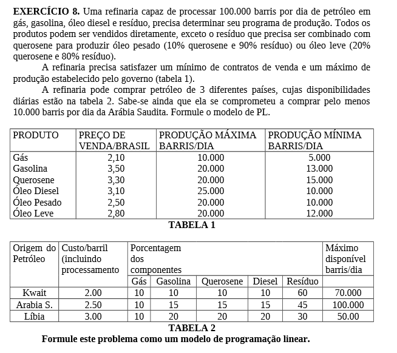
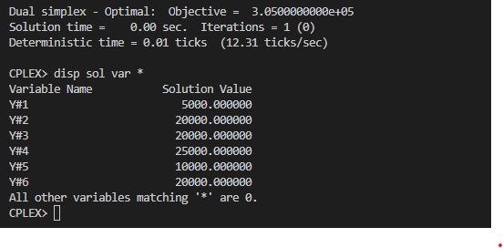

# 8

## Código ZIMPL  file.zpl

    # Produtos: Gás, Gasolina, Querosene, Óleo Diesel, Oleo Pesado, Oleo Leve
    set p := {1 to 6};

    # Paises de origem do petroleo: Kwait, Arabia, Libia
    set o := {1 to 3};

    # derivados do petroleo : Gás, Gasolina, Querosene, Óleo Diesel, Residuo
    set d := { 1 to 5};

    # pais de origem * derivados do petroleo
    set od := o * d;

    # porcentagem dos componentes conforme pais de origem
    param OD[od] :=
        <1, 1> 0.1, <1, 2> 0.1,  <1, 3> 0.1,  <1, 4> 0.1,  <1, 5> 0.6,
        <1, 1> 0.1, <1, 2> 0.15, <1, 3> 0.15, <1, 4> 0.15, <1, 5> 0.45,
        <1, 1> 0.1, <1, 2> 0.20, <1, 3> 0.2,  <1, 4> 0.2,  <1, 5> 0.3;

    # maximo de barril disponivel dia
    param D[o] := <1> 70000, <2> 100000, <3> 50000;

    # custo do barill
    param C[o] := <1> 3, <2> 2.5, <3> 3.0;

    # preco de venda dos produtos
    param V[p] := <1> 2.1, <2> 3.5, <3> 3.3, <4> 3.1, <5> 2.5, <6> 2.8;

    # producao maxima barris/dia
    param Max[p] := <1> 10000, <2> 20000, <3> 20000, <4> 25000, <5> 20000, <6> 20000;

    # producao maxima barris/dia1
    param Min[p] := <1> 5000, <2> 13000, <3> 15000, <4> 10000, <5> 10000, <6> 12000;

    # quantidade de barril comprado dos paises de origem
    var X[o] >= 0;

    # quantidade de produtos produzidos
    var Y[p] >= 0;

    # maximo de barris por dia
    param M := 100000;

    maximize lucro :
        (sum <px> in p : Y[px] * V[px]) -    
        (sum <ox> in o : X[ox] * C[ox]);
    
    #  producao maxima paises de origem
    subto c1:
        forall <ox>in o :
            X[ox] <= D[ox];

    # producao maxima na refinaria
    subto c2:
        sum <px> in p : Y[px]  <= M;

    # producao minima e maxima na refinaria
    subto c3:
        forall <px> in p :
            Y[px] <= Max[px] and Y[px] >= Min[px];

## CLI ZIMPL

Comandos para compilar arquivo *.zpl:

    zimpl file.zpl
    <!-- output  file.lp -->
    <!-- output  file.tbl -->

## CLI CPLEX

Abrir CLI CPLEX:

    cplex

Comando para ler modelo compilado do ZIMPL no CPLEX:

    r file.lp

Comando para otimizar problema lido:

    opt

Comando exibir solução:

    disp sol var *

