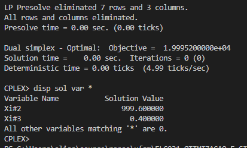

# 10

## Código ZIMPL  file.zpl

    # soja, milho, cana
    set ingredientes := {1, 2, 3};

    # calcio, proteina, carboidratos
    set nutrientes := {1, 2, 3};

    param perceNutrSoja[nutrientes] := <1> 0.002, <2> 0.5, <3> 0.08;
    param perceNutrMilho[ingredientes] := <1> 0.01, <2> 0.09, <3> 0.02;
    param perceNutrCana[ingredientes] := <1> 0.03, <2> 0.0, <3> 0.02;

    param custoIngredKg[ingredientes] := <1> 15, <2> 20, <3> 8;

    param minimoFabricadoKg := 1000;

    var quantNutrSojaKg[nutrientes] >= 0;
    var quantNutrMilhoKg[ingredientes] >= 0;
    var quantNutrCanaKg[ingredientes] >= 0;

    minimize custo : 
        (sum <n> in nutrientes : quantNutrSojaKg[n] * custoIngredKg[n]) +
        (sum <n> in nutrientes : quantNutrMilhoKg[n] * custoIngredKg[n]) +
        (sum <n> in nutrientes : quantNutrCanaKg[n] * custoIngredKg[n]);

    subto minimoProduzido :
        (sum <n> in nutrientes : quantNutrSojaKg[n] * perceNutrSoja[n]) +
        (sum <n> in nutrientes : quantNutrMilhoKg[n] * perceNutrMilho[n]) +
        (sum <n> in nutrientes : quantNutrCanaKg[n] * perceNutrCana[n]) >= minimoFabricadoKg;

    subto maximoCalcio :
        quantNutrSojaKg[1] * perceNutrSoja[1] + quantNutrMilhoKg[1] * perceNutrMilho[1] + quantNutrCanaKg[1] * perceNutrCana[1] <= 0.012;

    subto minimoCalcio :
        quantNutrSojaKg[1] * perceNutrSoja[1] + quantNutrMilhoKg[1] * perceNutrMilho[1] + quantNutrCanaKg[1] * perceNutrCana[1] >= 0.008;

    subto minimoProteina :
        quantNutrSojaKg[2] * perceNutrSoja[2] + quantNutrMilhoKg[2] * perceNutrMilho[2] + quantNutrCanaKg[2] * perceNutrCana[2] >= 0.22;

    subto maximoCarboidrato :
        quantNutrSojaKg[3] * perceNutrSoja[3] + quantNutrMilhoKg[3] * perceNutrMilho[3] + quantNutrCanaKg[3] * perceNutrCana[3] <= 0.2;

    ## CLI ZIMPL

Comandos para compilar arquivo *.zpl:

    zimpl file.zpl
    <!-- output  file.lp -->
    <!-- output  file.tbl -->

## CLI CPLEX

Abrir CLI CPLEX:

    cplex

Comando para ler modelo compilado do ZIMPL no CPLEX:

    r file.lp

Comando para otimizar problema lido:

    opt

Comando exibir solução:

    disp sol var *

