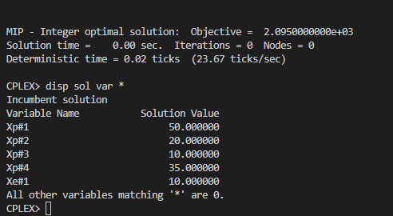

# 11

## Código ZIMPL  file.zpl

    set mes := {1, 2, 3, 4};

    param vendasContrat[mes] := <1> 40, <2> 30, <3> 10, <4> 35;
    # param maxProducao[mes] := <1> 50, <2> 20, <3> 30, <4> 35;
    # relaxado restricao da capacidade de producao no mes dois porque dá colisão com as vendas
    param maxProducao[mes] := <1> 50, <2> 35, <3> 30, <4> 35;

    param custoUnitario[mes] := <1> 18, <2> 17, <3> 23, <4> 17;
    param custoEstoque[mes] := <1> 3, <2> 2, <3> 3, <4> 4;

    var producaoMensal[mes] integer >= 0;

    minimize custo : 
        (sum <m> in mes : producaoMensal[m] * custoUnitario[m]) -
        (sum <m> in mes : producaoMensal[m] * custoEstoque[m]);

    subto contratoVendas :
    forall <m> in mes : producaoMensal[m] >= vendasContrat[m];

    subto limiteProducao :
        forall <m> in mes : producaoMensal[m] <= maxProducao[m];

## CLI ZIMPL

Comandos para compilar arquivo *.zpl:

    zimpl file.zpl
    <!-- output  file.lp -->
    <!-- output  file.tbl -->

## CLI CPLEX

Abrir CLI CPLEX:

    cplex

Comando para ler modelo compilado do ZIMPL no CPLEX:

    r file.lp

Comando para otimizar problema lido:

    opt

Comando exibir solução:

    disp sol var *

