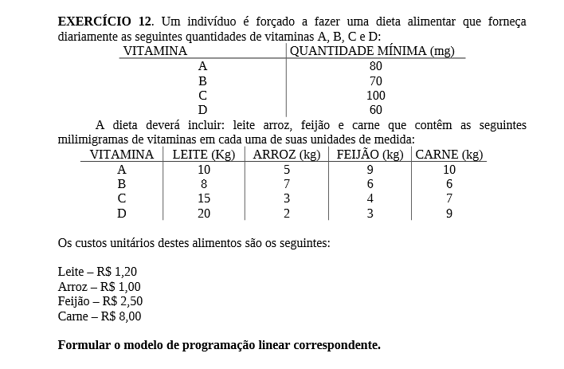

# 12

## Código ZIMPL  file.zpl

    # A, B, C, D
    set vitaminas := {1, 2, 3, 4};

    # leite, arroz, feijão, carne
    set alimentos := {1, 2, 3, 4};

    param minVitaminasMg[vitaminas] := <1> 0.00008, <2> 0.00007, <3> 0.0001, <4> 0.00006;

    param vitaminaA[alimentos] := <1> 0.00001,  <2> 0.000005,  <3> 0.000009, <4> 0.00001;
    param vitaminaB[alimentos] := <1> 0.000008, <2> 0.000007,  <3> 0.000006, <4> 0.000006;
    param vitaminaC[alimentos] := <1> 0.000015, <2> 0.000003,  <3> 0.000004, <4> 0.000007;
    param vitaminaD[alimentos] := <1> 0.00002,  <2> 0.000002,  <3> 0.000003, <4> 0.000009;

    param custoAlimentoReais[alimentos] := <1> 1.20, <2> 1, <3> 2.5, <4> 8;

    var quantAlimento[alimentos] >= 0;

    minimize custo : 
        sum <a> in alimentos:
            custoAlimentoReais[a] * quantAlimento[a];

    subto minVitaminaA :
            (sum <a> in alimentos: vitaminaA[a] * quantAlimento[a]) >= minVitaminasMg[1];
        
    subto minVitaminaB :
            (sum <a> in alimentos: vitaminaB[a] * quantAlimento[a]) >= minVitaminasMg[2];

    subto minVitaminaC :
            (sum <a> in alimentos: vitaminaC[a] * quantAlimento[a]) >= minVitaminasMg[3];
        
    subto minVitaminaD :
            (sum <a> in alimentos: vitaminaD[a] * quantAlimento[a]) >= minVitaminasMg[4];

## CLI ZIMPL

Comandos para compilar arquivo *.zpl:

    zimpl file.zpl
    <!-- output  file.lp -->
    <!-- output  file.tbl -->

## CLI CPLEX

Abrir CLI CPLEX:

    cplex

Comando para ler modelo compilado do ZIMPL no CPLEX:

    r file.lp

Comando para otimizar problema lido:

    opt

Comando exibir solução:

    disp sol var *

