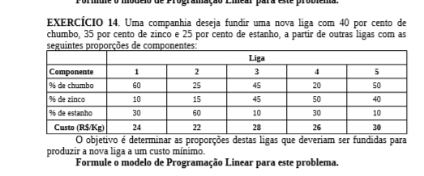

# 14

## Código ZIMPL  file.zpl

    # chumbo, zinco, estanho
    set metais := {1 to 3};
    set ligas := {1 to 5};

    set indexLigaMetal := metais * ligas;

    param composicaoLiga[metais] := <1> 0.4, <2> 0.35, <3> 0.25;

    # param composicaoLiga1[metais] := 
    # param composicaoLiga2[metais] := 
    # param composicaoLiga3[metais] := 
    # param composicaoLiga4[metais] := 
    # param composicaoLiga5[metais] := 

    # param composicaoLiga[indexLigaMetal] :=  
    #         <1, 1> 0.6,    <2, 1> 0.1,     <3, 1> 0.3;
    #         <1, 2> 0.25,   <2, 2> 0.15,    <3, 2> 0.6;
    #         <1, 3> 0.45,   <2, 3> 0.45,    <3, 3> 0.1;
    #         <1, 4> 0.2,    <2, 4> 0.5,     <3, 4> 0.3;
    #         <1, 5> 0.5,    <2, 5> 0.4,     <3, 5> 0.1;

    param custoLiga[ligas] := <1> 24, <2> 22, <3> 28, <4> 26, <5> 30;

    var composicaoLigaMetal[indexLigaMetal] >= 0;

    minimize custo :
            forall <l> in ligas:
                    (sum <m> in metais : composicaoLigaMetal[m,l]) * custoLiga[l];

    subto composicaoLiga :
            forall <m> in metais:
                    (sum <l> in ligas : composicaoLigaMetal[m,l]) == composicaoLiga[m];

## CLI ZIMPL

Comandos para compilar arquivo *.zpl:

    zimpl file.zpl
    <!-- output  file.lp -->
    <!-- output  file.tbl -->

## CLI CPLEX

Abrir CLI CPLEX:

    cplex

Comando para ler modelo compilado do ZIMPL no CPLEX:

    r file.lp

Comando para otimizar problema lido:

    opt

Comando exibir solução:

    disp sol var *

