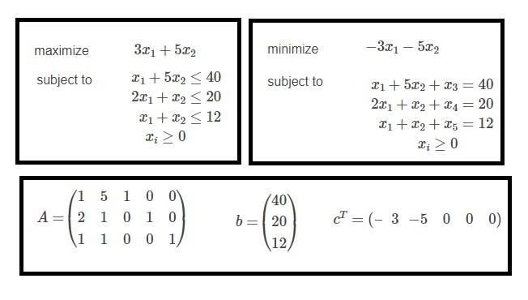
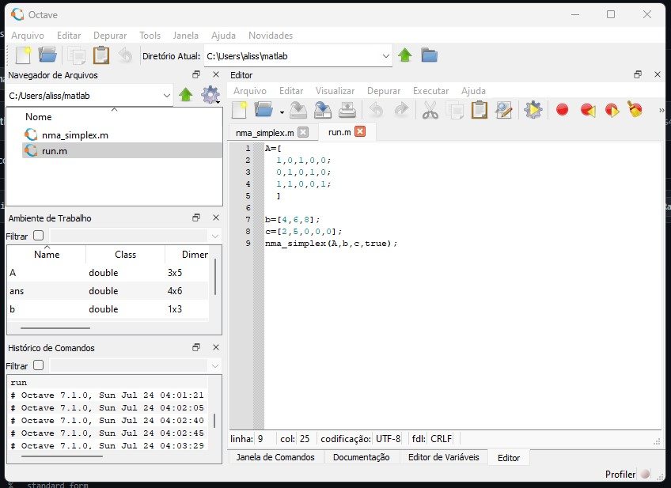
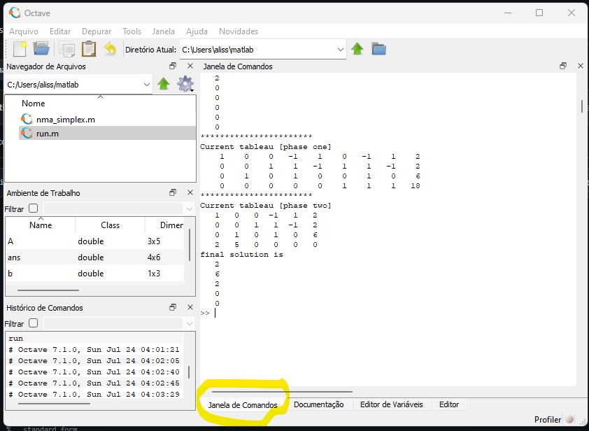

# ELC931-Otimização-Sistemas

Repositório para resolução das listas de problemas de programação linear.

## Exercícios Resolvidos

* [Lista Modelagem](Lista1/README.md)
* [Lista Dualidade](lista-dualidade/README.md)

### Solução com `Zimple` e `CPLEX`

<!-- lista de itens -->

Modela-se a resolução utilizando-se a linguagem matemática ZIMPL depois compila-se o modelo e resolve-o com o solver CPLEX.

Necessário instalar o CPLEX e o ZIMPL.

O ZIMPL já vêm com um executável sem instalação, mas o CPLEX precisa ser instalado.

O download do ZIMPL pode ser obtido através dos links:

* [Repositório Oficial](https://zimpl.zib.de/download/)
* [Nesse repositório](https://github.com/sganzerla/ELC931-OTIMIZACAO-E-SISTEMAS/blob/main/zimpl.exe)

O download do CPLEX pode ser obtido através do link (necessário criar uma conta utilizando email acadêmico):

* [Repositório Oficial](https://www.ibm.com/academic/topic/data-science)

### Solução com `MATLAB` ou `Octave`

Utilizando-se o script [matlab](.\matlab\nma_simplex.m) em qualquer uma das ferramentas pode-se obter os passos no tablot até a solução ótima através do métodos `SIMPLEX`, incluindo fase I e fase II.

Depois de criado o primeiro script dentro da ferramenta, utilizar a seguinte sintaxe dentro de outro arquivo para chamar a função. Deve-se colocar o problema na forma padrão e separar os dados em três matrizes.

    A=[1,5,1,0,0; 
    2,1,0,1,0; 
    1,1,0,0,1]; 
    
    b=[40,20,12]; 
    c=[-3,-5,0,0,0]; 
    nma_simplex(A,b,c,true);

Rodando no `Octave` script do método `SIMPLEX`.

Visualizando a resposta.

## Referências

* [simplex-algorithm for MATLAB by Mohammad Daneshian](https://www.mathworks.com/matlabcentral/fileexchange/85223-linear-programming-simplex-algorithm)
* [Zimpl User Guide](resources/ZIMPL.png)
* [Manual IBM CPLEX](https://www.ibm.com/docs/en/icos/12.10.0?topic=SSSA5P_12.10.0/ilog.odms.studio.help/Optimization_Studio/topics/COS_home.html)
