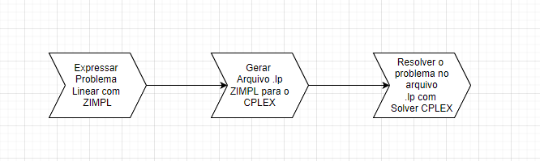

# ELC931-OTIMIZACAO-E-SISTEMAS

Repositório para resolução das listas de problemas de programação linear.

Modela-se a resolução utilizando-se a linguagem matemática ZIMPL depois compila-se o modelo e resolve-o com o solver CPLEX.

## Listas

<!-- lista de itens -->
* [Lista 1](Lista1/README.md)

### Referências

* 
* 
