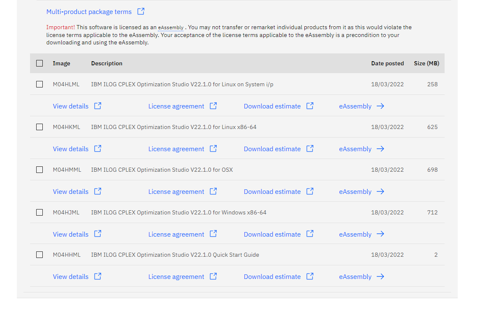

# ELC931-Otimização-Sistemas

Repositório para resolução das listas de problemas de programação linear.

## Exercícios Resolvidos

* [Lista Modelagem](lista-modelagem/README.md)
* [Lista Simplex](lista-simplex/README.md)
* [Lista Dualidade](lista-dualidade/README.md)
* [Prova 2004](prova-2004/README.md)
* [Prova 2019](prova-2019/README.md)
* [Atividade Final](atividade-final/README.md)

## ZIMPL

Utiliza-se a linguagem de programação matemática `ZIMPL` para expressar a função objetivo, as variáveis e as restrições, ela gera um arquivo `.lp` que depois é lido por um resolvedor como o `CPLEX`.

O download do `ZIMPL` pode ser obtido através dos links:

* [Repositório Oficial](https://zimpl.zib.de/download/)
* [Nesse repositório](https://github.com/sganzerla/ELC931-OTIMIZACAO-E-SISTEMAS/blob/main/zimpl.exe)

## CPLEX

O download do `CPLEX` pode ser obtido através do link oficial, é necessário criar uma conta na `IBM`. Há opções para obtê-lo utilizando um email acadêmico, obter licenciamento ou ainda amostra gratuita:

* [Repositório Oficial](https://www.ibm.com/academic/topic/data-science)

## Python

Pode-se também utilizar a liguagem python para expressar o modelo em substituição ao `ZIMPL` tendo como vantagem o uso da API do `CPLEX` de forma integrada no mesmo arquivo. [Aqui](tutorial/README.md) segue um tutorial de configuração.

## Referências

* [Zimpl User Guide](resources/ZIMPL.png)
* [Manual IBM CPLEX](https://www.ibm.com/docs/en/icos/12.10.0?topic=SSSA5P_12.10.0/ilog.odms.studio.help/Optimization_Studio/topics/COS_home.html)
