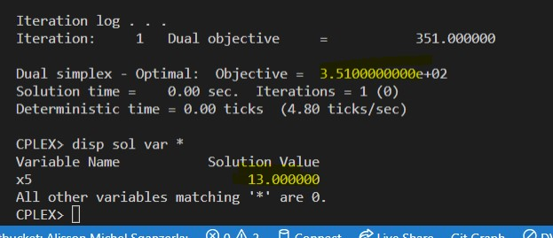

# 9.16-D

<!-- ## Resolução com planilhas

### Problema Primal

### Problema Dual

 -->

## Resolução com solver ZIMPL e CPLEX

### Problema Primal `pp.zpl`

    # oposto do sinal nas restrições do dual

    # tipos de alimentos
    var x1 >= 0;   
    var x2 >= 0; 
    var x3 >= 0; 
    var x4 >= 0;   
    var x5 >= 0; 
    var x6 >= 0; 

    # reduzir o custo
    minimize Z : 
        35*x1 + 30*x2 + 60*x3 + 50*x4 + 27*x5 + 22*x6;

    # mínimo vitamina A
    subto c1: 
        1*x1 + 0*x2 + 2*x3 + 2*x4 + 1*x5 + 2*x6 >= 9;
        
    # minimo da vitamina C
    subto c2:
        0*x1 + 1*x2 + 3*x3 + 1*x4 + 3*x5 + 2*x6 >= 39;

<!-- ### Problema Dual `pd.zpl`

    # oposto do sinal nas restrições do primal
    # misturas quimicas
    var w1 <= 0; 
    var w2 >= 0; 

    # maximizar a quantidade de misturas quimicas
    maximize Z : 
        90*w1 + 4*w2;

    # valor maximo do solvente 1
    subto c1: 
        120*w1 + 2*w2  <= 12;
        
    #  valor maximo do solvente 2
    subto c2:
        90*w1 + 6*w2  <= 10;

    #  valor maximo do solvente 3
    subto c3:
        -1*w1 + 0*w2  <= 0;

 -->
