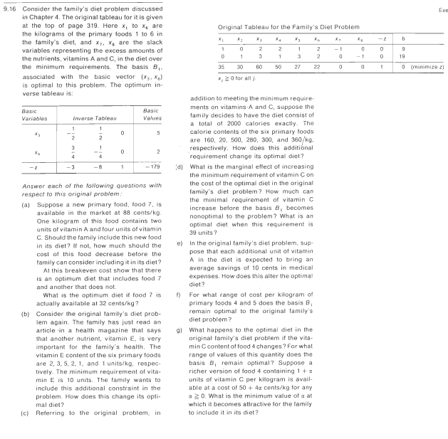
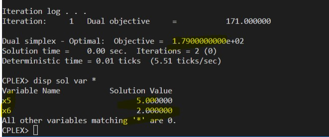
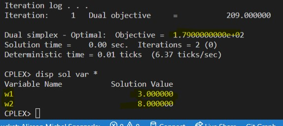
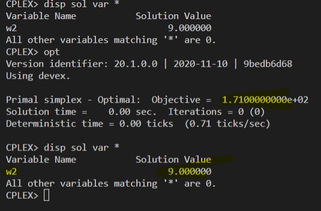

# 9.16-E

<!-- ## Resolução com planilhas

### Problema Primal

### Problema Dual

 -->

## Resolução com solver ZIMPL e CPLEX

### Problema Primal `pp.zpl`

    # oposto do sinal nas restrições do dual

    # tipos de alimentos
    var x1 >= 0;   
    var x2 >= 0; 
    var x3 >= 0; 
    var x4 >= 0;   
    var x5 >= 0; 
    var x6 >= 0; 

    # reduzir o custo
    minimize Z : 
        35*x1 + 30*x2 + 60*x3 + 50*x4 + 27*x5 + 22*x6;

    # mínimo vitamina A
    subto c1: 
        1*x1 + 0*x2 + 2*x3 + 2*x4 + 1*x5 + 2*x6 >= 9;
        
    # minimo da vitamina C
    subto c2:
        0*x1 + 1*x2 + 3*x3 + 1*x4 + 3*x5 + 2*x6 >= 19;

### Problema Dual Orignal `pd.zpl`

    # oposto do sinal nas restrições do primal

    # vitaminas 
    var w1 >= 0;   
    var w2 >= 0; 

    maximize Z : 
        9*w1 + 19*w2;

    # maximo do alimento 1
    subto c1: 
        1*w1 + 0*w2 <= 35;
        
    # maximo do alimento 2
    subto c2: 
        0*w1 + 1*w2 <= 30;

    # maximo do alimento 3
    subto c3: 
        2*w1 + 3*w2 <= 60;

    # maximo do alimento 4
    subto c4: 
        2*w1 + 1*w2 <= 50; 

    # maximo do alimento 5
    subto c5: 
        1*w1 + 3*w2 <= 27;

    # maximo do alimento 6
    subto c6: 
        2*w1 + 2*w2 <= 22;

### Problema Dual Alterado `pd2.zpl`

    # oposto do sinal nas restrições do primal

    # vitaminas 
    var w1 >= 0;   
    var w2 >= 0; 

    maximize Z : 
        -10*w1 + 19*w2;

    # maximo do alimento 1
    subto c1: 
        1*w1 + 0*w2 <= 35;
        
    # maximo do alimento 2
    subto c2: 
        0*w1 + 1*w2 <= 30;

    # maximo do alimento 3
    subto c3: 
        2*w1 + 3*w2 <= 60;

    # maximo do alimento 4
    subto c4: 
        2*w1 + 1*w2 <= 50; 

    # maximo do alimento 5
    subto c5: 
        1*w1 + 3*w2 <= 27;

    # maximo do alimento 6
    subto c6: 
        2*w1 + 2*w2 <= 22;

