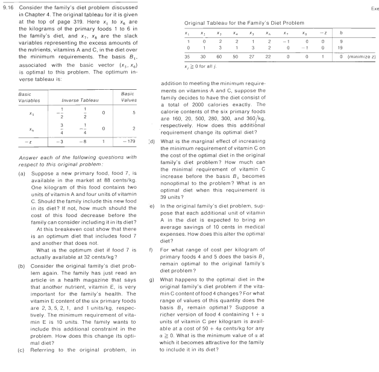

# 9.16

- [9.16-0](9.16-0/README.md)
- [9.16-A](9.16-A/README.md)
- [9.16-B](9.16-B/README.md)
- [9.16-C](9.16-C/README.md)
- [9.16-D](9.16-D/README.md)
- [9.16-E](9.16-E/README.md)
- [9.16-F](9.16-F/README.md)
- [9.16-G](9.16-G/README.md)
