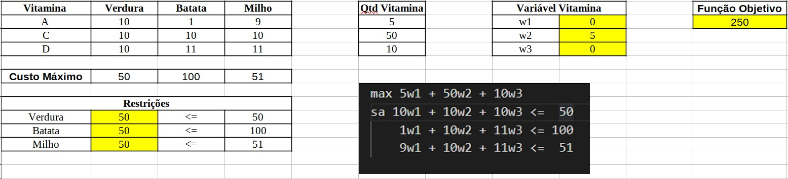
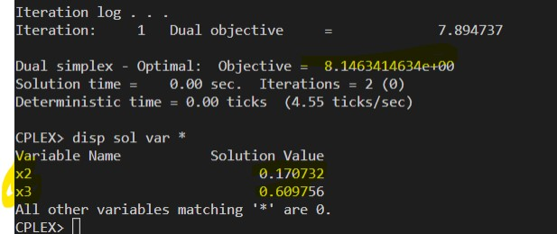
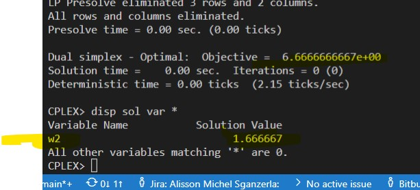

# 9.17-C

<!-- ## Resolução com planilhas

### Problema Primal

### Problema Dual

 -->

## Resolução com solver ZIMPL e CPLEX

    ### Problema Primal `pp.zpl`

    # oposto do sinal nas restrições do dual

    # tipos de solventes
    var x2 >= 0;   
    var x3 >= 0; 
    var x5 >= 0; 

    # reduzir o custo
    minimize Z : 
        12*x2 + 10*x3 + 0*x5;

    # mínimo mistura química 1
    subto c1: 
        120*x2 + 114*x3 - 1*x5 >= 90;
        
    # máximo mistura química 2
    subto c2:
        2*x2 + 6*x3 + 0*x5 <= 4;

### Problema Dual `pd.zpl`

    # oposto do sinal nas restrições do primal
    # misturas quimicas
    var w1 <= 0; 
    var w2 >= 0; 

    # maximizar a quantidade de misturas quimicas
    maximize Z : 
        90*w1 + 4*w2;

    # valor maximo do solvente 1
    subto c1: 
        120*w1 + 2*w2  <= 12;
        
    #  valor maximo do solvente 2
    subto c2:
        114*w1 + 6*w2  <= 10;

    #  valor maximo do solvente 3
    subto c3:
        -1*w1 + 0*w2  <= 0;

