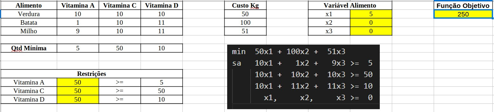
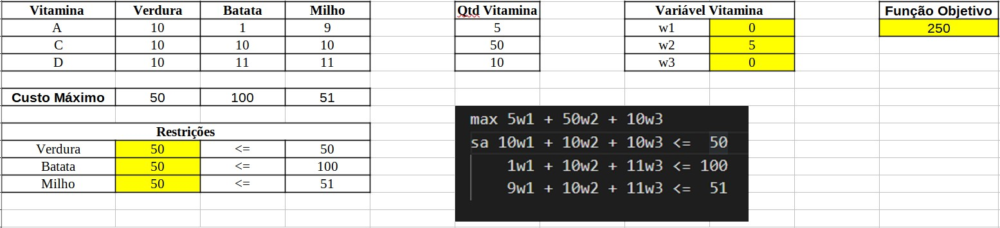

# 9.18-A

## Resolução com planilhas

### Problema Primal

### Problema Dual

## Resolução com solver ZIMPL e CPLEX

### Problema Primal `pp.zpl`

    # oposto do sinal nas restrições do dual

    var x1 >= 0; # produto 1
    var x2 >= 0; # produto 2
    var x3 >= 0; # produto 3
    var x4 >= 0; # produto 4

    # reduzir o custo
    minimize Z : 
        -2*x1 - 4*x2 - 1*x3 - 1*x4;

    # mínimo material 1
    subto c1: 
        1*x1 + 3*x2 + 0*x3 + 1*x4 <= 8;
        
    # mínimo material 2
    subto c2:
        2*x1 + 1*x2 + 0*x3 + 0*x4 <= 6;

    # mínimo material 3
    subto c3:
        0*x1 + 1*x2 + 4*x3 + 1*x4 <= 6;

### Problema Dual `pd.zpl`

    # oposto do sinal nas restrições do primal

    var w1 >= 0; # vitamina A
    var w2 >= 0; # vitamina C
    var w3 >= 0; # vitamina D

    # maximizar a quantidade de vitaminas
    maximize Z : 
        5*w1 + 50*w2 + 10*w3;

    # valor maximo com verduras
    subto c1: 
        10*w1 + 10*w2 + 10*w3 <= 50;
        
    # valor maximo com batatas
    subto c2:
        1*w1 + 10*w2 + 11*w3 <= 100;

    # valor maximo com milho
    subto c3:
        9*w1 + 10*w2 + 11*w3 <= 51;

