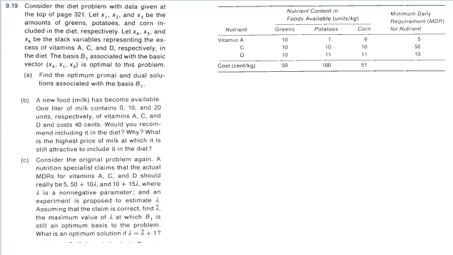
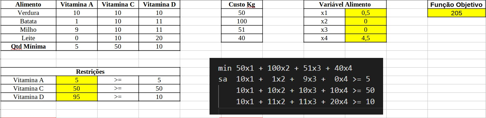
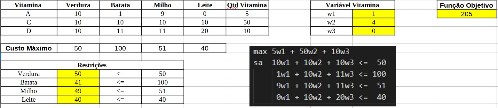
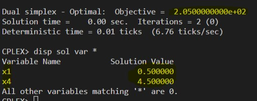
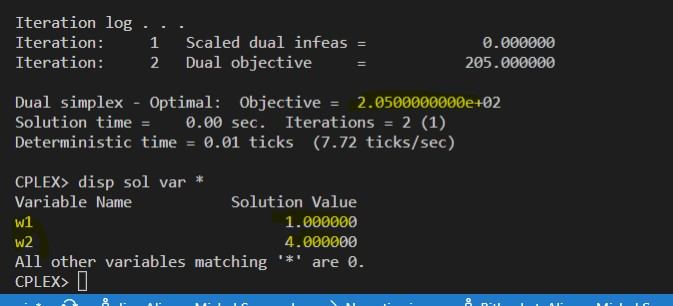

# 9.19-B

## Resolução com planilhas

### Problema Primal

### Problema Dual

## Resolução com solver ZIMPL e CPLEX

### Problema Primal `pp.zpl`

    # oposto do sinal nas restrições do dual

    var x1 >= 0; # verdura
    var x2 >= 0; # batata
    var x3 >= 0; # milho
    var x4 >= 0; # leite

    # reduzir o custo
    minimize Z : 
        50*x1 + 100*x2 + 51*x3 + 40*x4;

    # mínimo vitamina A
    subto c1: 
        10*x1 + 1*x2 + 9*x3 + 0*x4 >= 5;
        
    # mínimo vitamina B
    subto c2:
        10*x1 + 10*x2 + 10*x3 + 10*x4 >= 50;

    # mínimo vitamina C
    subto c3:
        10*x1 + 11*x2 + 11*x3 + 20*x4 >= 10;

### Problema Dual `pd.zpl`

    # oposto do sinal nas restrições do primal

    var w1 >= 0; # vitamina A
    var w2 >= 0; # vitamina C
    var w3 >= 0; # vitamina D

    # maximizar a quantidade de vitaminas
    maximize Z : 
        5*w1 + 50*w2 + 10*w3;

    # valor maximo com verduras
    subto c1: 
        10*w1 + 10*w2 + 10*w3 <= 50;
        
    # valor maximo com batatas
    subto c2:
        1*w1 + 10*w2 + 11*w3 <= 100;

    # valor maximo com milho
    subto c3:
        9*w1 + 10*w2 + 11*w3 <= 51;

    # valor maximo com milho
    subto c4:
        0*w1 + 10*w2 + 20*w3 <= 40;

