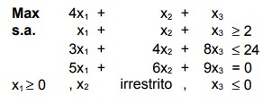
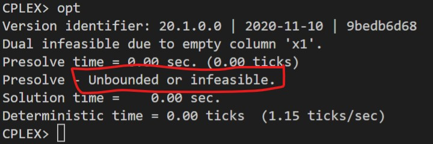
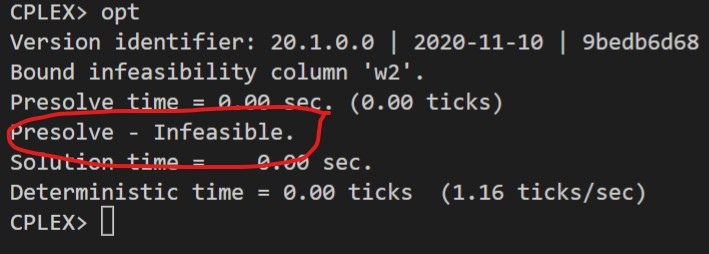

# 1-A

## Código ZIMPL

### Problema Primal `pp.zpl`

    # oposto do sinal nas restrições do dual
    var x1 >= 0; 
    var x2 >= -infinity;
    var x3 <= 0;

    maximize Z : 
        4*x1 + 1*x2 + 1*x3;
    
    subto r1: 
        1*x1 + 1*x2 + 1*x3 >= 2;

    subto r2:
        3*x1 + 4*x2 + 8*x3 <= 24;

    subto r3:
        5*x1 + 6*x2 + 9*x3 == 0;

### Problema Dual `pd.zpl`

    # oposto do sinal nas restrições do primal
    var w1 <= 0;
    var w2 >= 0;
    var w3 >= -infinity;

    minimize Z :
        2*w1 + 24*w2 + 0*w3;

    subto r1:
        1*w1 + 3*w2 + 5*w3 >= 4;

    subto r2:
        1*w1 + 4*w2 + 6*w3 == 1;

    subto r3:
        1*w1 + 8*w2 + 9*w3 <= 1;

