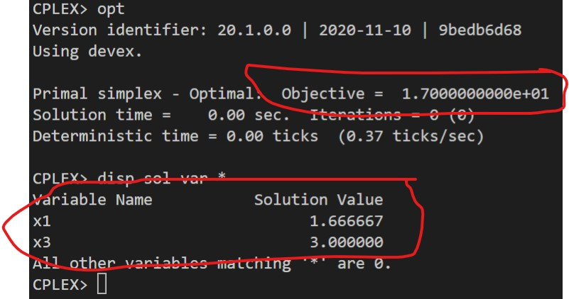
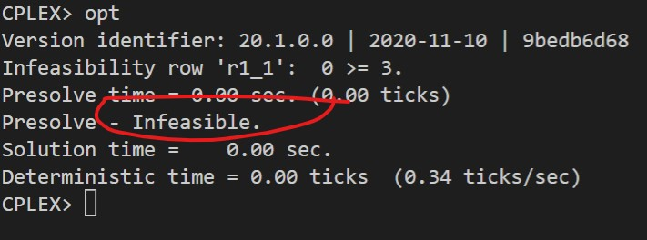

# 2

## Código ZIMPL

### Problema Primal `pp.zpl`

    # oposto do sinal nas restrições do dual
    var x1 >= 0; 
    var x2 >= 0;
    var x3 >= 0;

    maximize Z: 
        3*x1 + 1*x2 + 4*x3;

    subto r1: 
        6*x1 + 3*x2 + 5*x3 <= 25;

    subto r2:
        3*x1 + 4*x2 + 5*x3 <= 20;

### Problema Dual `pd.zpl`

    # oposto do sinal nas restrições do primal
    var w1 <= 0;
    var w2 <= 0;

    minimize Z :
        25*w1 + 20*w2;

    subto r1:
        6*w1 + 3*w2 >= 3;

    subto r2:
        3*w1 + 4*w2 >= 1;

    subto r3:
        5*w1 + 5*w2 >= 4;

## Solução CPLEX

### PP

### PD

