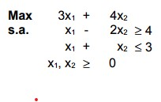
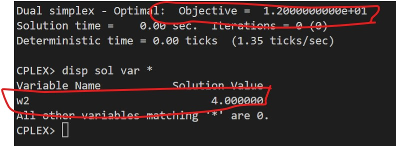

# 4-C

## Código ZIMPL

### Problema Primal `pp.zpl`

    # oposto do sinal nas restrições do dual
    var x1 >= 0;
    var x2 >= 0;

    maximize Z:
        3*x1 + 4*x2;

    subto r1:
        1*x1 - 2*x2 >= 4;

    subto r2:
        1*x1 + 1*x2 <= 3;

### Problema Dual `pd.zpl`

    # oposto do sinal nas restrições do primal
    var w1 <= 0;
    var w2 >= 0;

    minimize Z :
        4*w1 + 3*w2;

    subto r1:
        1*w1 + 1*w2 >= 3;

    subto r2:
        -2*w1 + 1*w2 >= 4;

