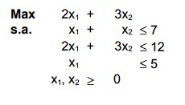

# 4-D

## Código ZIMPL

### Problema Primal `pp.zpl`

    # oposto do sinal nas restrições do dual
    var x1 >= 0;
    var x2 >= 0;

    maximize Z:
        2*x1 + 3*x2;

    subto r1:
        1*x1 + 1*x2 <= 7;

    subto r2:
        2*x1 + 3*x2 <= 12;

    subto r3:
        1*x1 <= 5;

### Problema Dual `pd.zpl`

    # oposto do sinal nas restrições do primal
    var w1 >= 0;
    var w2 >= 0;
    var w3 >= 0;

    minimize Z :
        7*w1 + 12*w2 + 5*w3;

    subto r1:
        1*w1 + 2*w2 + 1*w3 >= 2;

    subto r2:
        1*w1 + 3*w2 + 0*w3 >= 3;

