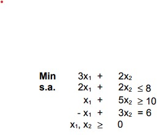
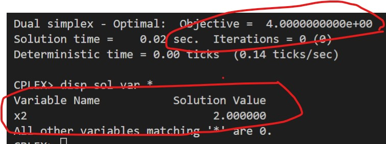

# 4-E

## Código ZIMPL

### Problema Primal `pp.zpl`

    # oposto do sinal nas restrições do dual
    var x1 >= 0;
    var x2 >= 0;

    minimize Z:
        3*x1 + 2*x2;

    subto r1:
        2*x1 + 2*x2 <= 8;

    subto r2:
        1*x1 + 5*x2 >= 10;

    subto r3:
        -1*x1 + 3*x2 == 6;

### Problema Dual `pd.zpl`

    # oposto do sinal nas restrições do primal
    var w1 >= 0;
    var w2 <= 0;
    var w3 >= -infinity;

    maximize Z :
        8*w1 + 10*w2 + 6*w3;

    subto r1:
        2*w1 + 1*w2 + -1*w3 >= 3;

    subto r2:
        2*w1 + 5*w2 + 3*w3 >= 2;

