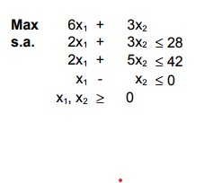
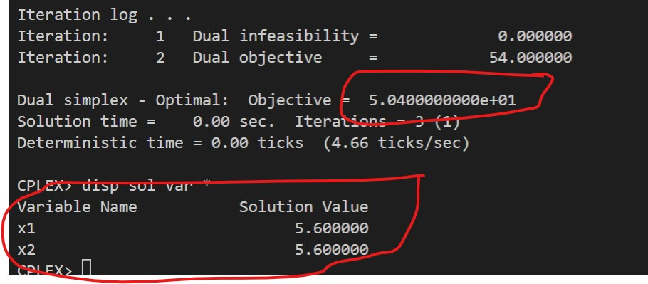
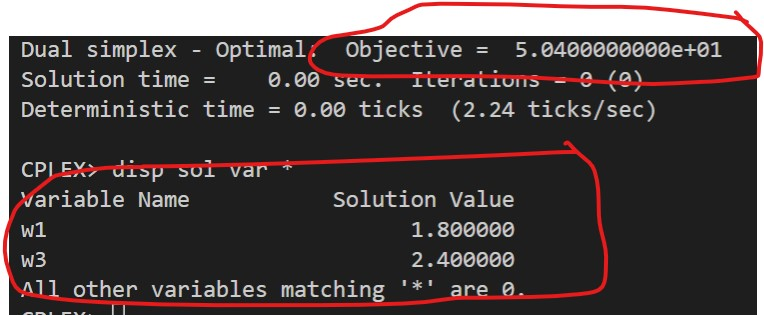

# 4-E

## Código ZIMPL

### Problema Primal `pp.zpl`

    # oposto do sinal nas restrições do dual
    var x1 >= 0;
    var x2 >= 0;

    maximize Z:
        6*x1 + 3*x2;

    subto r1:
        2*x1 + 3*x2 <= 28;

    subto r2:
        2*x1 + 5*x2 <= 42;

    subto r3:
        1*x1 - 1*x2 <= 0;

### Problema Dual `pd.zpl`

    # oposto do sinal nas restrições do primal
    var w1 >= 0;
    var w2 <= 0;
    var w3 >= 0;

    minimize Z :
        28*w1 + 42*w2 + 0*w3;

    subto r1:
        2*w1 + 2*w2 + 1*w3 >= 6;

    subto r2:
        3*w1 + 5*w2 - 1*w3 >= 3;

## Solução CPLEX

### PP

### PD

