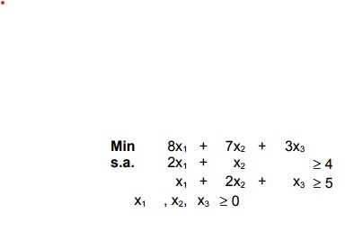
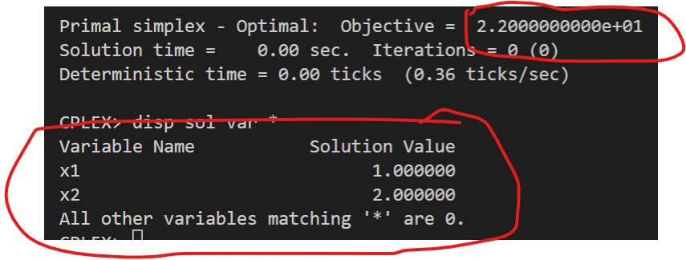
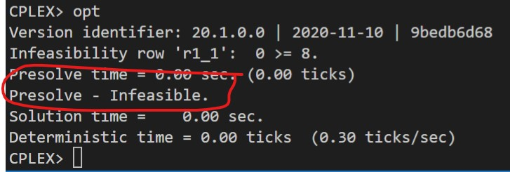

# 6-A

## Código ZIMPL

### Problema Primal `pp.zpl`

    # oposto do sinal nas restrições do dual
    var x1 >= 0;
    var x2 >= 0;
    var x3 >= 0;

    minimize Z:
        8*x1 + 7*x2 + 3*x3;

    subto r1:
        2*x1 + 1*x2 + 0*x3 >= 4;

    subto r2:
        1*x1 + 2*x2 + 1*x3 >= 5;

### Problema Dual `pd.zpl`

    # oposto do sinal nas restrições do primal
    var w1 <= 0;
    var w2 <= 0;

    maximize Z :
        4*w1 + 5*w2;

    subto r1:
        2*w1 + 1*w2 >= 8;

    subto r2:
        1*w1 + 2*w2 >= 7;

    subto r3:
        0*w1 + 1*w2 >= 3;

