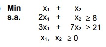
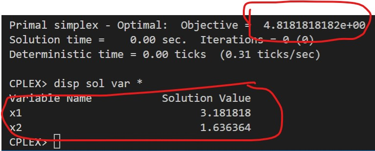
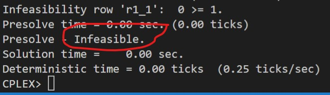

# 6-B

## Código ZIMPL

### Problema Primal `pp.zpl`

    # oposto do sinal nas restrições do dual
    var x1 >= 0;
    var x2 >= 0;

    minimize Z:
        1*x1 + 1*x2;

    subto r1:
        2*x1 + 1*x2 >= 8;

    subto r2:
        3*x1 + 7*x2 >= 21;

### Problema Dual `pd.zpl`

    # oposto do sinal nas restrições do primal
    var w1 <= 0;
    var w2 <= 0;

    maximize Z :
        8*w1 + 21*w2;

    subto r1:
        2*w1 + 3*w2 >= 1;

    subto r2:
        1*w1 + 7*w2 >= 1;

