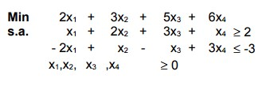
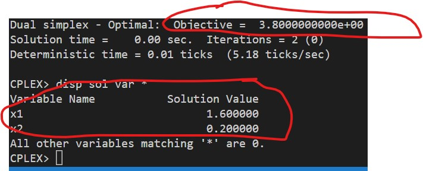
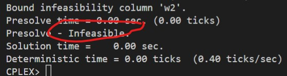

# 6-D

## Código ZIMPL

### Problema Primal `pp.zpl`

    # oposto do sinal nas restrições do dual
    var x1 >= 0;
    var x2 >= 0;
    var x3 >= 0;
    var x4 >= 0;

    minimize Z:
        2*x1 + 3*x2 + 5*x3 + 6*x4;

    subto r1:
        1*x1 + 2*x2 + 3*x3 + 1*x4 >= 2;

    subto r2:
        -2*x1 + 1*x2 - 1*x3 + 3*x4 <= -3;

### Problema Dual `pd.zpl`

    # oposto do sinal nas restrições do primal
    var w1 <= 0;
    var w2 >= 0;

    maximize Z :
        2*w1 - 3*w2;

    subto r1:
        1*w1 - 2*w2 >= 2;

    subto r2:
        2*w1 + 1*w2 >= 3;

    subto r3:
        3*w1 - 1*w2 >= 5;

    subto r4:
        1*w1 + 3*w2 >= 6;

