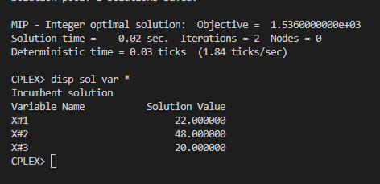

# 1

## Código ZIMPL  file.zpl

    # produtos
    # 1, 2, 3
    set p := {1, 2, 3};
    
    # maquinas
    # fresa, torno e retifica
    set m := {1, 2, 3};

    # produto * máquina
    set pm := p*m;

    # tempo disponivel cada máquina
    param T[m] := <1> 500, <2> 350, <3> 150;

    # lucro por produto
    param L[p] := <1> 30, <2> 12, <3> 15;

    # tempo de produção
    param TP[pm] := <1, 1> 9, <1,2> 3, <1, 3> 5,
                    <2, 1> 5, <2,2> 4, <2, 3> 0,
                    <3, 1> 3, <3,2> 0, <3, 3> 2;

    # potencial vendas
    param V3 :=  20;

    # quantidade de produtos produzir
    var X[p] integer >= 0; 

    maximize lucro :
        sum <px> in p : L[px] * X[px] ;
    
    # max horas trabalhadas pelas máquinas
    subto c1: 
        forall <mx> in m : 
            sum <px> in p : TP[px, mx] * X[px] <= T[mx];

    # max produzido produto 3
    subto c2:
        X[3] <= 20;

## CLI ZIMPL

Comandos para compilar arquivo *.zpl:

    zimpl file.zpl
    <!-- output  file.lp -->
    <!-- output  file.tbl -->

## CLI CPLEX

Abrir CLI CPLEX:

    cplex

Comando para ler modelo compilado do ZIMPL no CPLEX:

    r file.lp

Comando para otimizar problema lido:

    opt

Comando exibir solução:

    disp sol var *

