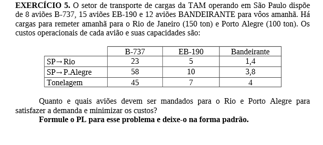
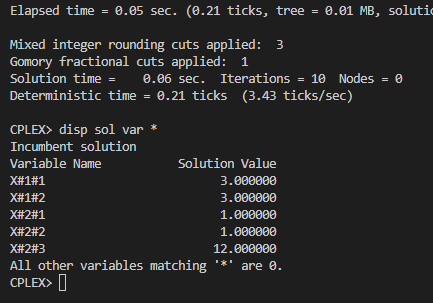

# 5

## Código ZIMPL  file.zpl

    # aviao: B-737, EB-190, Bandeirante
    set a := {1 to 3};

    # destino das viagens: Rio, Porto Alegre
    set d := {1, 2};

    # destino * aviao
    set da := d * a;

    # quantidade de aviões
    param Q[a] := <1> 8, <2> 15, <3> 12;

    # tonelagem dos aviões
    param T[a] := <1> 45, <2> 7, <3> 4;

    # custos de transporte para cada destino conforme avião
    param DA[da] := 
            <1,1> 23, <1,2>  5, <1,3> 1.4,
            <2,1> 58, <2,2> 10, <2,3> 3.8;

    # carga transportada
    param C[d] := <1> 150, <2> 100;

    # quantidade de avioes enviadas para cada destino
    var X[da] integer >= 0;

    minimize custo : 
        sum <dx, ax> in da :  X[dx, ax] * DA[dx, ax];

    # carga transportada deve ser igual a carga do destino
    subto c1 :
        forall <dx> in d :
            sum <ax> in a :
                X[dx, ax] * T[ax] >= C[dx]; 

    # quantidade de aviões limitada para as viagens
    subto c2:
        forall <ax> in a :
            sum <dx> in d :
                X[dx, ax] <= Q[ax];

## CLI ZIMPL

Comandos para compilar arquivo *.zpl:

    zimpl file.zpl
    <!-- output  file.lp -->
    <!-- output  file.tbl -->

## CLI CPLEX

Abrir CLI CPLEX:

    cplex

Comando para ler modelo compilado do ZIMPL no CPLEX:

    r file.lp

Comando para otimizar problema lido:

    opt

Comando exibir solução:

    disp sol var *

