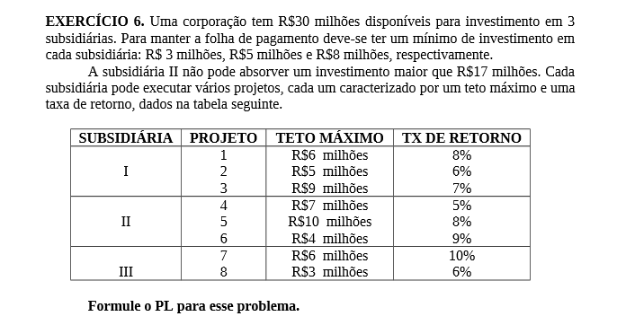
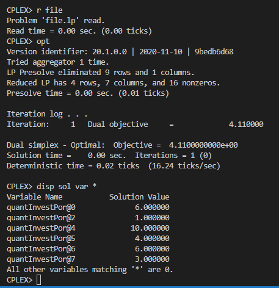

# 6

## Código ZIMPL  file.zpl

    # subsidiarias : 1, 2, 3
    set s := {1 to 3};

    # projetos
    set p := {1 to 8};

    # teto investimento por projeto
    param T[p] := <1> 6, <2> 5, <3> 9, <4> 7, <5> 10, <6> 4, <7> 6, <8> 3;

    # taxa de retorno por projeto
    param R[p] := <1> 0.08, <2> 0.06, <3> 0.07, <4> 0.05, <5> 0.08, <6> 0.09, <7> 0.1, <8> 0.06;

    # investimento max 
    param I := 30;

    # minimo investido em cada uma
    param M[s] := <1> 3, <2> 5, <3> 8;

    # maximo investido sub-2
    param M2 := 17; 

    # quantidade de investimento em cada projeto
    var X[p] >= 0;

    maximize lucro : 
        sum <px> in p : X[px] * R[px]; 

    # limite investimento total
    subto c1 :
        sum <px> in p : X[px] <= I;

    # restrição de investimento mínimo Filial 1
    subto c2 :
        sum <px> in p with px <= 3 : X[px] >= M[1];

    # restrição de investimento mínimo Filial 2
    subto c3 :
    M2 >= sum <px> in p with px < 7 and px > 3 : X[px] >= M[2];

    # restrição de investimento mínimo Filial 3
    subto c4 :
        sum <px> in p with px >= 7 : X[px] >= M[3];

    # maximo investido em cada projeto
    subto c5 :
        forall <px> in p :
            X[px] <= T[px];

## CLI ZIMPL

Comandos para compilar arquivo *.zpl:

    zimpl file.zpl
    <!-- output  file.lp -->
    <!-- output  file.tbl -->

## CLI CPLEX

Abrir CLI CPLEX:

    cplex

Comando para ler modelo compilado do ZIMPL no CPLEX:

    r file.lp

Comando para otimizar problema lido:

    opt

Comando exibir solução:

    disp sol var *

