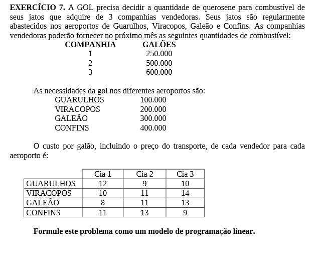
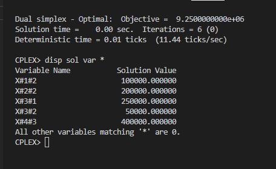

# 7

## Código ZIMPL  file.zpl

    # Aeroportos: Guarulho, Viracopos, Galeão, Confins
    set a := {1 to 4};

    # Cia Aerea: 1, 2, 3
    set c := {1 to 3};

    # aerporto * cia aerea
    set ac := a * c;

    # querosone disponivel nas Cias Aereas
    param Q[c] := <1> 250000, <2> 500000, <3>600000;

    # demanda dos aeroportos
    param D[a] := <1> 100000, <2> 200000, <3> 300000, <4> 400000;

    # custo de transporte em cada aeroporto por cia aerea
    param AC[ac] := 
                    <1, 1> 12, <1, 2>  9, <1, 3> 10,
                    <2, 1> 10, <2, 2> 11, <2, 3> 14,
                    <3, 1> 8,  <3, 2> 11, <3, 3> 13,
                    <4, 1> 11, <4, 2> 13, <4, 3>  9;
    
    #  quantidade de querosene para cada aeroporto e cia aerea
    var X[ac] >= 0;

    minimize custo : 
        sum <ax, cx> in ac:
            X[ax, cx] * AC[ax, cx];

    # quantidade de combustivel disponivel
    subto c1:
        forall <cx> in c :
            sum <ax> in a :
                X[ax, cx] <= Q[cx];

    #  quantidade de querosene para cada aeroporto

    subto c2:
        forall <ax> in a :
            sum <cx> in c :
                X[ax, cx] >= D[ax];

## CLI ZIMPL

Comandos para compilar arquivo *.zpl:

    zimpl file.zpl
    <!-- output  file.lp -->
    <!-- output  file.tbl -->

## CLI CPLEX

Abrir CLI CPLEX:

    cplex

Comando para ler modelo compilado do ZIMPL no CPLEX:

    r file.lp

Comando para otimizar problema lido:

    opt

Comando exibir solução:

    disp sol var *

