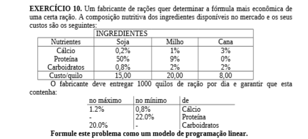

# 10

## Código ZIMPL  file.zpl

    # Ingredientes: soja, milho, cana
    set i := {1 to 3};

    # Nutrientes: calcio, proteina, carboidratos
    set n := {1 to 3};

    # nutriente * ingrediente 
    set ni := n * i;

    # restrições: minimo e maximas
    set r := {1, 2};

    set rn :=  r * n;

    param RN[rn] := 
            <1, 1> 0.008, <1, 2> 0.22, <1, 3> 0, #MIN
            <2, 1> 0.012, <2, 2> 0,    <2, 3> 0.2; #MAX

    # percentual de nutriente em cada ingrediente
    param NI[ni] := 
            <1, 1> 0.002, <1, 2> 0.01,  <1, 3> 0.03,
            <2, 1> 0.50,  <2, 2> 0.09,  <2, 3> 0,
            <3, 1> 0.008, <3, 2> 0.02,  <3, 3> 0.02;

    # custo do kg
    param C[i] := <1> 15, <2> 20, <3> 8;

    # minimio de producao
    param MIN_KG := 1000;

    # quantidade de cada ingrediente em kg
    var Xi[i] >= 0;

    minimize custo:
            sum <ix> in i: Xi[ix] * C[ix];

    # quantidade mínima dos ingredientes
    subto c1 :
            sum <ix> in i: Xi[ix] >= MIN_KG;

    # quantidade minima de cada nutriente
    subto c2 :
            forall <nx> in n :
            sum <ix> in i with ix < 3 : Xi[ix] * NI[nx, ix] >= RN[1, nx] ;
    
    #  quantidade maxima de cada nutriente
    subto c3 :
            forall <nx> in n :
            sum <ix> in i with ix != 2 : Xi[ix] * NI[nx, ix] <= RN[2, nx] ;

## CLI ZIMPL

Comandos para compilar arquivo *.zpl:

    zimpl file.zpl
    <!-- output  file.lp -->
    <!-- output  file.tbl -->

## CLI CPLEX

Abrir CLI CPLEX:

    cplex

Comando para ler modelo compilado do ZIMPL no CPLEX:

    r file.lp

Comando para otimizar problema lido:

    opt

Comando exibir solução:

    disp sol var *

