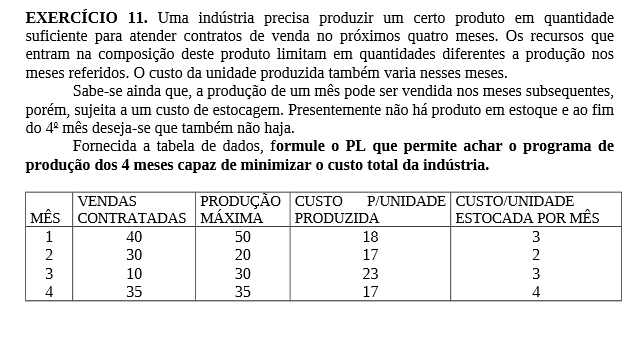
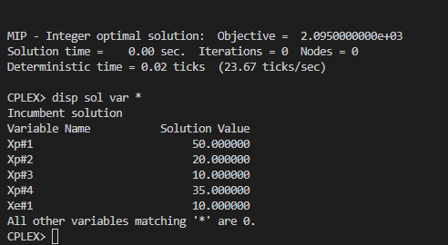

# 11

## Código ZIMPL  file.zpl

    # MES: 1, 2, 3, 4
    set m := {1, 2, 3, 4};

    # Vendas contratadas para os meses
    param V[m] := <1> 40, <2> 30, <3> 10, <4> 35;

    # Capacidade de produção mensal 
    param P[m] := <1> 50, <2> 20, <3> 30, <4> 35;

    # Custo unitario producao em cada mes
    param C[m] := <1> 18, <2> 17, <3> 23, <4> 17;

    # Custo unitario estocagem em cada mes
    param E[m] := <1> 3, <2> 2, <3> 3, <4> 4;

    # producao mensal
    var Xp[m] integer >= 0;
    # quantidade em estoque
    var Xe[m] integer >= 0;

    minimize custo : 
        sum <mx> in m : Xp[mx] * C[mx] + sum <mx> in m :  Xe[mx] * E[mx];

    # atender a demanda dos contratos balanceando o estoque
    subto c1 :
    forall <mx> in m : Xp[1] - Xe[1] - V[1] == 0;

    # não exceder a capacidade de produção
    subto c2 :
        forall <mx> in m : Xp[mx] <= P[mx];

    subto c3 :
        forall <mx> in m with mx > 1: Xp[mx] + Xe[mx-1] - V[mx] - Xe[mx] == 0;

## CLI ZIMPL

Comandos para compilar arquivo *.zpl:

    zimpl file.zpl
    <!-- output  file.lp -->
    <!-- output  file.tbl -->

## CLI CPLEX

Abrir CLI CPLEX:

    cplex

Comando para ler modelo compilado do ZIMPL no CPLEX:

    r file.lp

Comando para otimizar problema lido:

    opt

Comando exibir solução:

    disp sol var *

