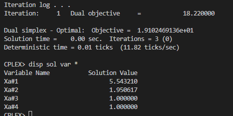

# 12

## Código ZIMPL  file.zpl

    # vitaminas: A, B, C, D
    set v := {1 to 4};

    # alimento: leite, arroz, feijão, carne
    set a := {1 to 4};

    # vitamina * alimento
    set va := v * a;

    # minimo de cada vitamina em miligramas
    param M[v] := <1> 0.00008, <2> 0.00007, <3> 0.0001, <4> 0.00006;

    # Percentual de cada vitamina em miligramas por cada kilo de alimento
    param P[va] := 
                    <1,1> 0.00001,  <1,2>  0.000005,  <1,3> 0.000009, <1,4> 0.00001, 
                    <2,1> 0.000008, <2,2>  0.000007,  <2,3> 0.000006, <2,4> 0.000006, 
                    <3,1> 0.000015, <3,2>  0.000003,  <3,3> 0.000004, <3,4> 0.000007, 
                    <4,1> 0.00002,  <4,2>  0.000002,  <4,3> 0.000003, <4,4> 0.000009;

    # Custo do kg de cada cada alimento
    param C[a] := <1> 1.20, <2> 1, <3> 2.5, <4> 8;

    # quantidade comprada de cada alimento
    var Xa[a] >= 1;

    minimize custo : 
        sum <ax> in a:
            C[ax] * Xa[ax];

    #  minimo de vitamina na dieta
    subto c1 :
            forall <vx> in v :
                    sum <vx, ax> in va : P[vx, ax] * Xa[ax] >= M[vx];
                    
    # utilizar todos os alimentos na composição da dieta
    subto c2:
            forall <ax> in a : Xa[ax] >= 1; 

## CLI ZIMPL

Comandos para compilar arquivo *.zpl:

    zimpl file.zpl
    <!-- output  file.lp -->
    <!-- output  file.tbl -->

## CLI CPLEX

Abrir CLI CPLEX:

    cplex

Comando para ler modelo compilado do ZIMPL no CPLEX:

    r file.lp

Comando para otimizar problema lido:

    opt

Comando exibir solução:

    disp sol var *

