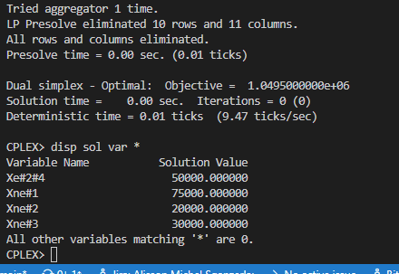

# 13

## Código ZIMPL  file.zpl

    # fabrica: 1, 2
    set f := {1, 2};

    # Distribuidores
    set d := {1 to 4};

    set fd := f * d;

    # Capacidade de producao maxima 
    param F[f] := <1> 80000, <2> 65000;

    # Demanda do distribuidor
    param D[d] := <1> 75000, <2> 20000, <3> 30000, <4> 50000; # valor distribuidor 4 colocado para teste

    # Custo de transporte de cada produto das filiais ate os respectivos distribuidores
    param C[fd] := 
                    <1,1> 50, <1,2> 10, <1,3> 70, <1,4> 30,
                    <2,1> 60, <2,2> 40, <2,3> 60, <2,4> 20;

    # Taxa por produto nao entregue
    param T[d] := <1> 0.5, <2> 0.3, <3> 0.2, <4> 0.0;

    # quantidade de produtos entregues por cada filial a cada distribuidor
    var Xe[fd] >= 0;
    # quantidade de produtos nao entregues a cada distribuidor
    var Xne[d] >= 0;
    
    minimize custo :
            sum <fx, dx> in fd : Xe[fx, dx] * C[fx, dx] +
            sum <dx> in d : Xne[dx] * T[dx];

    # limite Fabricacao maximo das filiais
    subto c1 :
            forall <fx> in f :
                    sum <fx, dx> in fd : Xe[fx, dx] <= F[fx];

    # demanda do distribuidor 4 deve ser atendida somando-se as duas filiais
    subto c2 : 
            sum <fx> in f : Xe[fx, 4] >= D[4];

    # distribuicao a cada filial maior ou igual a demanda menos variavel de folga
    subto c3 :
            forall <dx> in d with dx < 4 :
                    sum <fx, dx> in fd :
                            Xe[fx, dx] >= D[dx] - Xne[dx];

    # demanda de cada filial
    subto c4 :
            forall <dx> in d :
                    sum <fx, dx> in fd : 
                            Xe[fx, dx] <= D[dx];

## CLI ZIMPL

Comandos para compilar arquivo *.zpl:

    zimpl file.zpl
    <!-- output  file.lp -->
    <!-- output  file.tbl -->

## CLI CPLEX

Abrir CLI CPLEX:

    cplex

Comando para ler modelo compilado do ZIMPL no CPLEX:

    r file.lp

Comando para otimizar problema lido:

    opt

Comando exibir solução:

    disp sol var *

