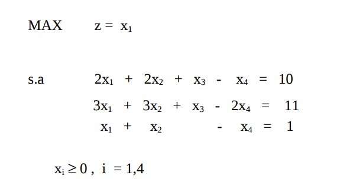
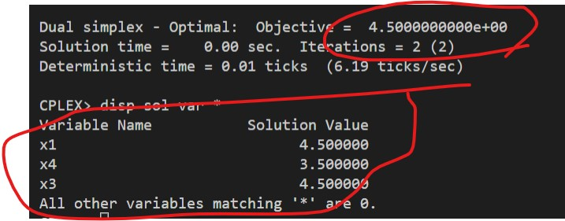

# 15

## Código ZIMPL

### Problema Primal `pp.zpl`

    var x1 >= 0;
    var x2 >= 0;
    var x3 >= 0;
    var x4 >= 0;

    maximize Z:
        1*x1;

    subto c1:
        2*x1 + 2*x2 + 1*x3 - 1*x4 == 10;

    subto c2:
        3*x1 + 3*x2 + 1*x1 - 2*x4 == 11;

    subto c3:
        1*x1 + 1*x2 + 0*x3 - 1*x4 == 1;

