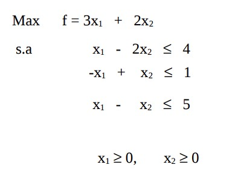
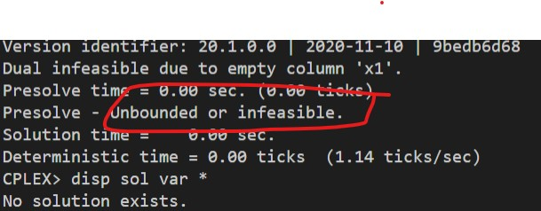

# 14

## Código ZIMPL

### Problema Primal `pp.zpl`

    var x1 >= 0;
    var x2 >= 0;

    maximize Z:
        1*x1 + 1*x2;

    subto c1:
        -1*x1 + 1*x2 <= 2;

    subto c2:
        1*x1 - 2*x2 <= 6;

