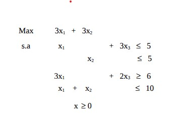
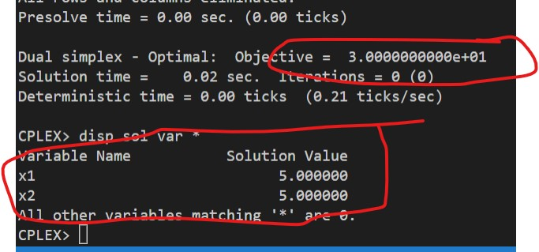

# 17

## Código ZIMPL

### Problema Primal `pp.zpl`

    var x1 >= 0;
    var x2 >= 0;
    var x3 >= 0;

    maximize Z:
        3*x1 + 3*x2;

    subto c1:
        1*x1 + 0*x2 + 3*x3 <= 5;

    subto c2:
        0*x1 + 1*x2 + 0*x3 <= 5;

    subto c3:
        3*x1 + 0*x2 + 2*x3 >= 6;

    subto c4:
        1*x1 + 1*x2 + 0*x3 <= 10;

