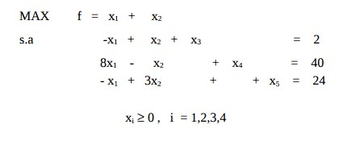
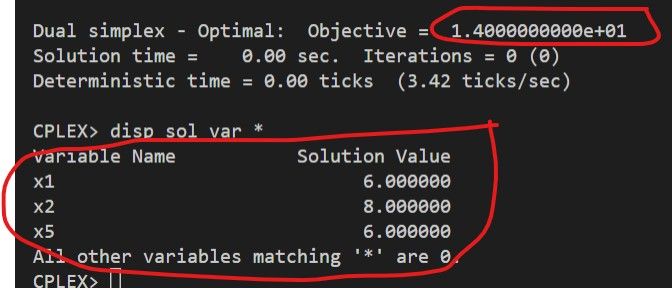

# 18-II

## Código ZIMPL

### Problema Primal `pp.zpl`

    var x1 >= 0;
    var x2 >= 0;
    var x3 >= 0;
    var x4 >= 0;
    var x5 >= 0;

    maximize Z:
        1*x1 + 1*x2;

    subto c1:
        -1*x1 + 1*x2 + 1*x3 + 0*x4 + 0*x5 == 2;

    subto c2:
        8*x1 - 1*x2 + 0*x3 + 1*x4 + 0*x5 == 40;

    subto c3:
        -1*x1 + 3*x2 + 0*x3 + 0*x4 + 1*x5 == 24;

