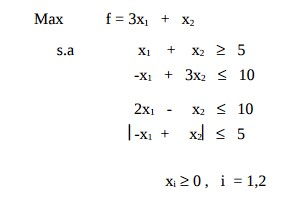

# 18-III

## Código ZIMPL

### Problema Primal `pp.zpl`

    var x1 >= 0;
    var x2 >= 0;

    maximize Z:
        3*x1 + 1*x2;

    subto c1:
        1*x1 + 1*x2 >= 5;

    subto c2:
        -1*x1 + 3*x2 <= 10;

    subto c3:
        2*x1 - 1*x2 <= 10;

    subto c4:
        -1*x1 + 1*x2 <= 5;

