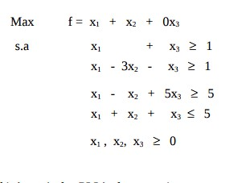
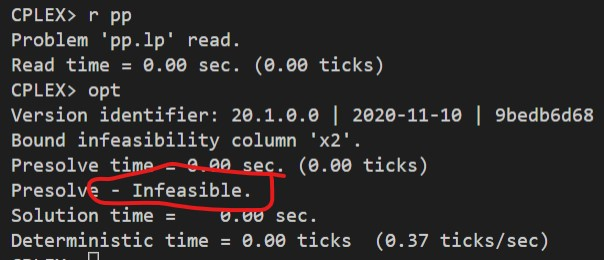

# 18-IV

## Código ZIMPL

### Problema Primal `pp.zpl`

    var x1 >= 0;
    var x2 >= 0;
    var x3 >= 0;

    maximize Z:
        1*x1 + 1*x2 + 0*x3;

    subto c1:
        1*x1 + 0*x2 + 1*x3 >= 1;

    subto c2:
        1*x1 - 3*x2 - 1*x1 >= 1;

    subto c3:
        1*x1 - 1*x2 + 5*x3 >= 5;

    subto c4:
        1*x1 + 1*x2 + 1*x3 <= 5;

