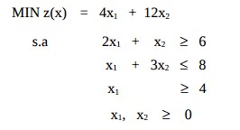
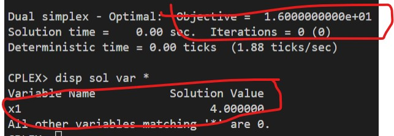

# 20

## Código ZIMPL

### Problema Primal `pp.zpl`

    var x1 >= 0;
    var x2 >= 0;

    minimize Z:
        4*x1 + 12*x2;

    subto c1:
        2*x1 + 1*x2 >= 6;

    subto c2:
        1*x1 + 3*x2 <= 8;

    subto c3:
        1*x1 + 0*X2 >= 4;

