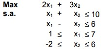
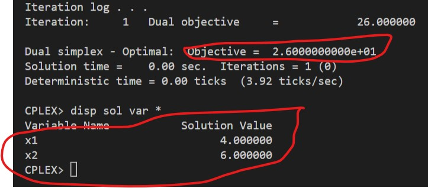

# 2

## Código ZIMPL

### Problema Primal `pp.zpl`

    var x1 <= 7;
    var x2 <= 6;

    maximize Z:
        2*x1 + 3*x2;

    subto c1:
        1*x1 + 1*x2 <= 10;

    subto c2:
        1*x1 - 1*x2 <= 6;

    subto canalizado1:
        1*x1 >= 1;

    subto canalizado2:
        1*x2 >= -2;

