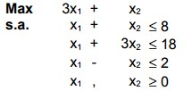
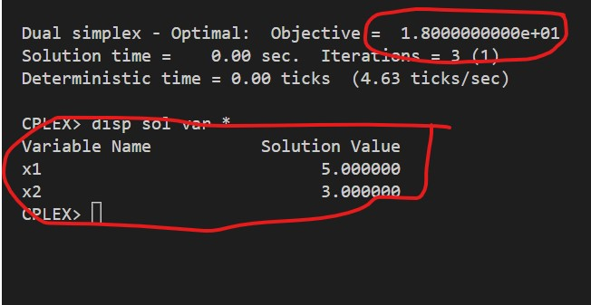

# 3

## Código ZIMPL

### Problema Primal `pp.zpl`

    var x1 >= 0;
    var x2 >= 0;

    maximize Z:
        3*x1 + 1*x2 ;

    subto c1:
        1*x1 + 1*x2 <= 8;

    subto c2:
        1*x1 + 3*x2 <= 18;

    subto c3:
        1*x1 - 1*x2 <= 2;

