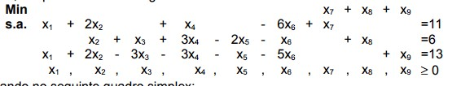
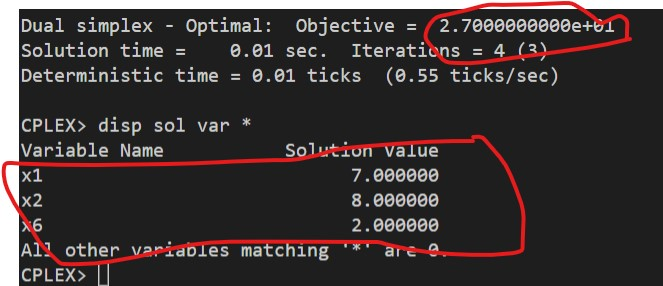

# 4-C

O que aconteceria se fosse introduzida uma nova atividade com
coeficiente de custo c7 = 4 e A7 = [3 -1 1]t?

## Código ZIMPL

### Problema Primal `pp.zpl`

var x1 >= 0;
var x2 >= 0;
var x3 >= 0;
var x4 >= 0;
var x5 >= 0;
var x6 >= 0;
var x7 >= 0;

minimize Z:
    3*x1 + 2*x2 - 3*x3 - 6*x4 + 10*x5 - 5*x6 - 7*x7;

subto c1:
    1*x1 + 2*x2 + 0*x3 + 1*x4 + 0*x5 - 6*x6 + 1*x7 == 11;

subto c2:
    0*x1 + 1*x2 + 1*x3 + 3*x4 - 2*x5 - 1*x6 + 2*x7 == 6;

subto c3:
    1*x1 + 2*x2 - 3*x3 - 3*x4 - 1*x5 - 5*x6 +- 3*x7 == 13;

