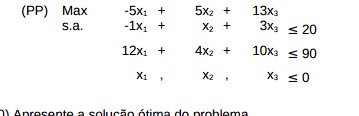
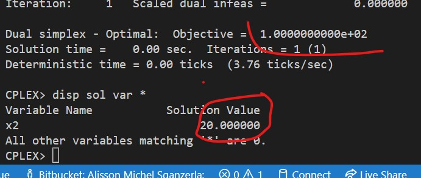

# 3-C

 Introduza uma nova variável x6, com os coeficientes:
    c6 = 10
    a16 = 3
    a26 = 5

## Código ZIMPL

### Problema Primal `pp.zpl`

    var x1 >= 0;
    var x2 >= 0;
    var x3 >= 0;
    var c6 >= 0;

    maximize Z: 
        -5*x1 + 5*x2 + 13*x3 + 10*c6;

    subto c1:
        -1*x1 + 1*x2 + 3*x3 + 3*c6 <= 20;

    subto c2:
        12*x1 + 4*x2 + 10*x3 + 5*c6 <= 90;

