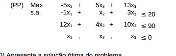
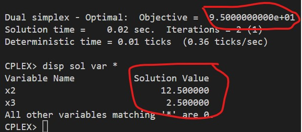

# 3-D

Introduza uma nova restrição 2x1 + 3x2 + 5x3 <= 50

## Código ZIMPL

### Problema Primal `pp.zpl`

    var x1 >= 0;
    var x2 >= 0;
    var x3 >= 0;

    maximize Z: 
        -5*x1 + 5*x2 + 13*x3;

    subto c1:
        -1*x1 + 1*x2 + 3*x3 <= 20;

    subto c2:
        12*x1 + 4*x2 + 10*x3 <= 90;

    subto c3:
        2*x1 + 3*x2 + 5*x3 <= 50;

